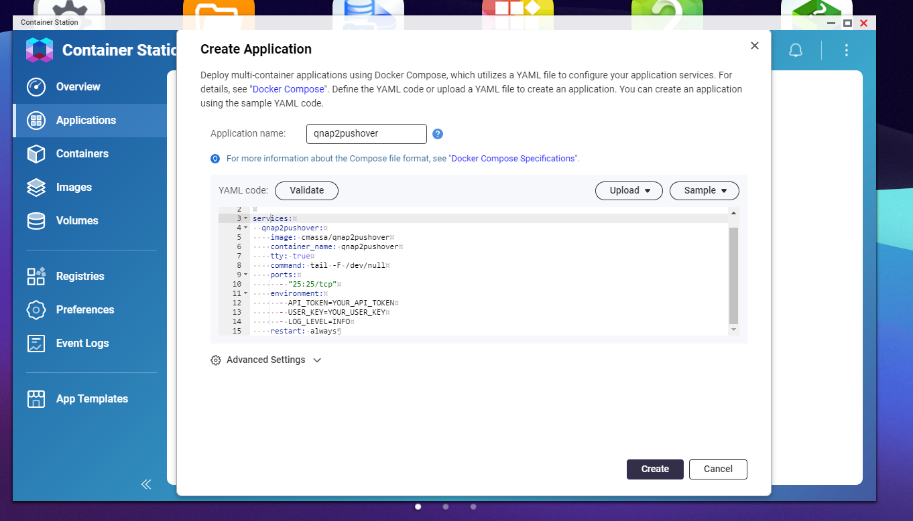
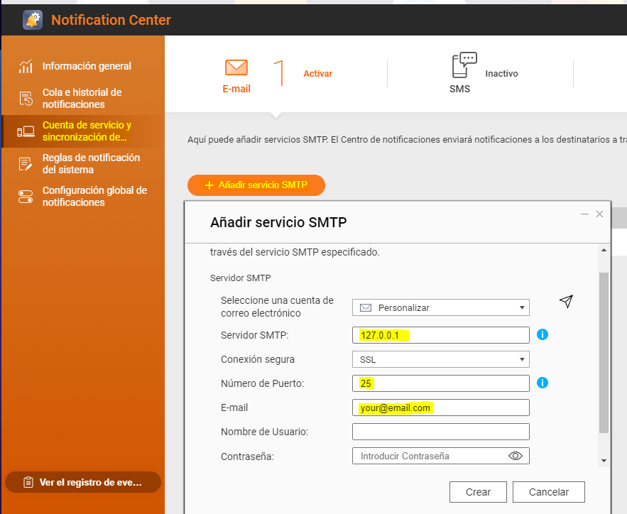
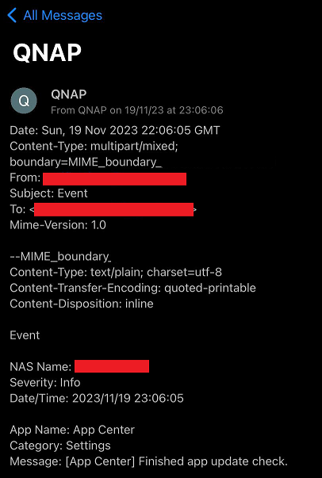

# qnap2pushover

[](https://hub.docker.com/repository/docker/cmassa/qnap2pushover)

This utility can be used on ContainerStation APP from [QNAP](https://www.qnap.com/) to send alert and notification emails to [Pushover](https://pushover.net/).

Runs an SMTP server using `aiosmtpd` (asyncio based SMTP server) library and transforms any email send to it into a Pushover notification. It is an alternative to avoid polling QNAP SQLite for events and use built-in 'Notifications Center' for sending notifications we are interested and also for not using email clients like Gmail or Outlook but our custom one.

## Usage

### QNAP ContainerStation

Get docker-compose.yml content and modify `API_TOKEN` and `USER_KEY` environment variables with Pushover ones:

```yaml
version: "3.9"

services:
  qnap2pushover:
    image: cmassa/qnap2pushover
    container_name: qnap2pushover
    tty: true
    command: tail -F /dev/null
    ports:
      - "25:25/tcp"
    environment:
      - API_TOKEN= # Put your app token here
      - USER_KEY= # Put your user token here
      - LOG_LEVEL=INFO
    restart: always
```

Open ContainerStation app and go to 'Applications' then press 'Create', paste previously modified YAML file and press 'Create' at the bottom:  


Once application appears with 'Running' state go to 'Control Panel > Notifications Center' and add a new SMTP service:


Setup can be tested by pressing on the paper plane on the top right:


### Docker compose

Modify environment variables `API_TOKEN` and `USER_KEY` on `docker-compose.yml`

```bash
    docker-compose up -d
```

### Standalone

***Requirement:*** Python >= 3.7

Add `.env` file to root directory and and add `API_TOKEN`, `USER_KEY` and `LOG_LEVEL` variables:

```bash
    API_TOKEN=...
    USER_KEY=...
    LOG_LEVEL=INFO
```

```bash
    pip3 install -r requirements.txt
    python3 qnap2pushover.py
```

### Docker CLI

```bash
    docker build . -t qnap2pushover
    docker run -d --name qnap2pushover -p 25:25 -e API_TOKEN="YOUR_API_TOKEN" -e USER_KEY="YOUR_USER_KEY" qnap2pushover
```
